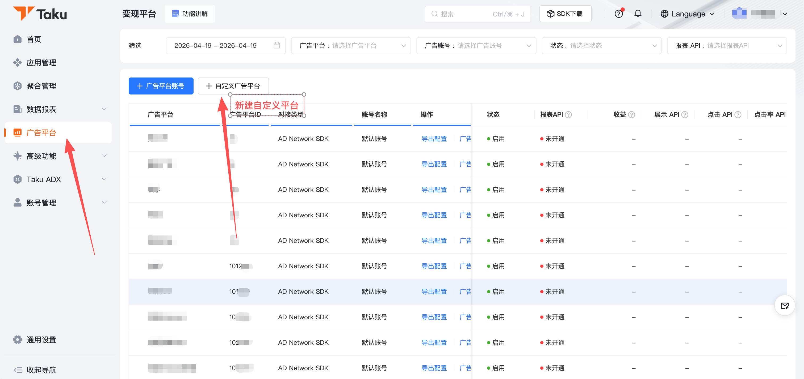
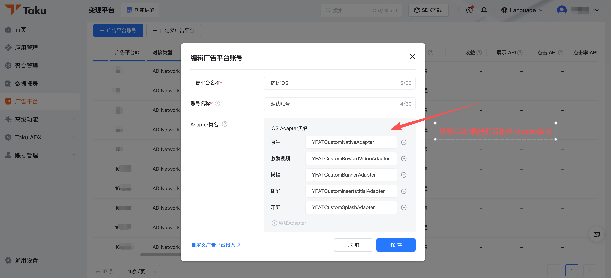
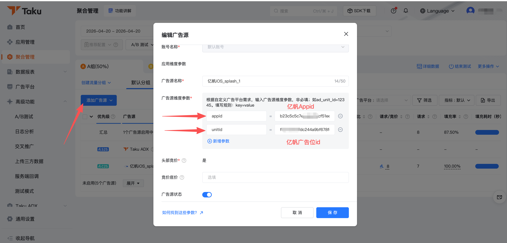

### 1. Taku（TopOn）自定义接入

#### 1.1 参考文档

- Taku 自定义广告平台文档：<https://help.takuad.com/docs/fRMh7C>
- Taku 自定义 Adapter 基类说明：<https://help.takuad.com/docs/iHxZQZ>
- Taku亿帆适配器Demo：https://github.com/com-yifan/ios-anythink-yf-adapter
- 亿帆SDK对接文档：https://github.com/com-yifan/ios-yf-sdk

#### 1.2 接入说明

当媒体通过 Taku（TopOn）平台接入亿帆广告能力，且采用"自定义 ADN / 自定义广告网络"方案时，可参考本节进行配置。

接入前请先确认以下信息已准备完成：

- 亿帆平台分配的 `AppID`
- 亿帆平台分配的广告位 ID
- 对应广告类型所需的 iOS Adapter 类名
- Taku 平台已开通自定义广告网络能力

#### 1.3 iOS 集成Taku亿帆适配器SDK方式

```ruby
# TakuSDK
pod 'AnyThinkiOS','6.5.43'
# Taku亿帆适配器，适用于Taku6.5.x版本
pod 'AnyThinkMediationYFAdapter'
# 亿帆SDK 部分适配器导入可亿帆对接文档3.2章节
pod 'YFAdsSDK', '6.1.0.0'
#  百度【必须】
pod 'BaiduMobAdSDK','10.032'
# 优量汇【必须】
pod 'GDTMobSDK' ,'4.15.75'
# 京东【必须】
pod 'JADYun', '2.6.8'
pod 'JADYunMotion', '2.6.8'  #京东摇一摇组件
# 穿山甲【必须】⚠️注意：旧版本有 按照2.3-1方式集成 的，需要去掉 TTSDKFramework
pod 'Ads-CN', '7.4.0.4', :subspecs => ['BUAdSDK','CSJMediation','BUAdLive-Framework']
# Gromore-Adn适配器
pod 'GMBaiduAdapter', '10.02.1'
pod 'GMGdtAdapter', '4.15.65.0'
pod 'GMKsAdapter', '4.11.20.1.0'
# 快手【必须】
pod 'KSAdSDK','5.1.20.1'
# 微信OpenSDK【必须】，如App内已通过其他方式集成OpenSDK，无需再次集成
pod 'WechatOpenSDK-XCFramework'

```

#### 1.4 平台配置说明

在 Taku 后台新增自定义广告网络时，需要按广告类型填写对应的 iOS Adapter 类名。

```text
开屏：YFATCustomSplashAdapter
激励视频：YFATCustomRewardVideoAdapter
插屏：YFATCustomInsertstitialAdapter
原生：YFATCustomNativeAdapter
横幅：YFATCustomBannerAdapter
```

如平台配置页区分"广告平台"和"广告源"两个层级，请确保两个层级填写的类名保持一致。

#### 1.5 广告源配置说明

在 Taku 聚合管理中新增广告源时，建议按如下规则填写：

- `AppID`：填写亿帆平台分配的 `AppID`
- `Placement ID / 广告位 ID`：填写亿帆平台分配的广告位 ID
- `Adapter 类名`：按广告类型填写对应 iOS Adapter 类名

#### 1.6 配置截图说明

- 新增自定义广告平台：亿帆



- 添加对应广告类型Adapter类名



- 广告位添加亿帆广告源：appid为亿帆AppID,unitid为亿帆广告位id



#### 1.7 注意事项

1. Taku 平台创建自定义广告网络后，建议在"广告平台"和"广告源"两个层级分别核对一次配置。
